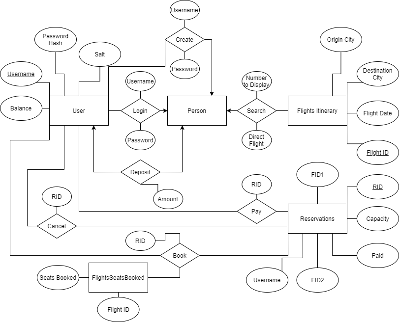

# Writeup

Three tables are stored in the database. 

In the Users table, the username, password_hash, salt, and balance attributes are stored. This is because it is unsafe to store plaintext passwords, so a password comparison can be done through comparing the input password hashed with the retrieved salt and comparing it to the retrieved password_hash. 

In the Reservations table, the rid, username, fid1, fid2, one_hop, paid, and canceled attributes are stored. Originally, a table called Itineraries was stored in the database too with attributes iid, fid1, and fid2. However, since displayed itineraries were only specific to each login session, the itineraries only needed to be saved locally and not in the database. Therefore, the fid1 and fid2 attributes were moved to the Reservations table. The Reservation rid attribute is also set to auto-increment upon tuple insertion. 

In the FlightSeatsBooked table, the fid and seats_booked attributes are stored. This table is necessary since the number of seats booked is not specified in the Flights table.

The logged in user's username is another field stored locally, since this attribute is only specific to each login session.